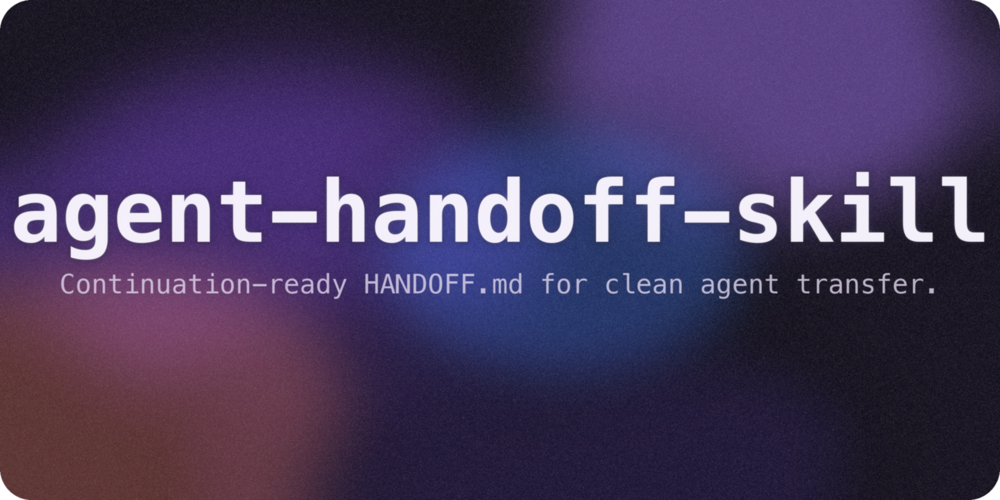

<p align="center"></p>

<h1 align="center">agent-handoff-skill</h1>
<p align="center">
  <em>A public packaging of the HANDOFF skill for creating continuation-ready HANDOFF.md documents.</em>
</p>
<p align="center">
  <a href="#quick-start">Quick Start</a> · <a href="#what-ships">What Ships</a> · <a href="#how-it-works">How It Works</a> · <a href="./README-Ko-KR.md">한국어</a>
</p>

---

> [!NOTE]
> This repository packages the `handoff` skill with its core manifest, canonical template, bilingual documentation, and reproducible cover asset. Optional example and eval artifacts are included only when they pass public-safety and public-value review.

## The Problem

Most session summaries are written like changelogs. They tell you what happened, but they do not let a fresh agent restart the work efficiently. The HANDOFF skill solves a narrower problem: produce a single `HANDOFF.md` that answers where the work stopped, what was done, what failed, what remains, and how to verify the current state.

## What Ships

### Required

- `SKILL.md` — the skill manifest and operating contract
- `templates/HANDOFF.md` — the canonical structure for generated handoff documents
- `README.md` / `README-Ko-KR.md` — public-facing docs
- `generate_cover.py` / `cover.png` — reproducible visual asset pair
- `LICENSE` / `.gitignore`

### Optional quality assets

If present in this repo, they were included intentionally after public-safety review:

- `examples/` — generic filled example(s) showing output quality
- `evals/` — public-safe eval cases that preserve quality expectations

## Quick Start

### Copy-Paste Install

```text
I want to install the handoff skill. Do these steps:
1. TMP_DIR=$(mktemp -d)
2. git clone https://github.com/wjgoarxiv/agent-handoff-skill.git "$TMP_DIR/agent-handoff-skill"
3. mkdir -p ~/.claude/skills/handoff
4. cp -r "$TMP_DIR/agent-handoff-skill/SKILL.md" "$TMP_DIR/agent-handoff-skill/templates" ~/.claude/skills/handoff/
5. If "$TMP_DIR/agent-handoff-skill/examples" exists, copy it too.
6. If "$TMP_DIR/agent-handoff-skill/evals" exists, copy it too.
7. Say "handoff skill installed successfully"
```

### Manual Install

```bash
TMP_DIR=$(mktemp -d)
git clone https://github.com/wjgoarxiv/agent-handoff-skill.git "$TMP_DIR/agent-handoff-skill"
cd "$TMP_DIR/agent-handoff-skill"

mkdir -p ~/.claude/skills/handoff
cp -r SKILL.md templates ~/.claude/skills/handoff/

# Optional quality assets
[ -d examples ] && cp -r examples ~/.claude/skills/handoff/
[ -d evals ] && cp -r evals ~/.claude/skills/handoff/
```

### Other Tools

| Tool | Skills Path | Install Pattern |
|------|-------------|-----------------|
| **Claude Code** | `~/.claude/skills/handoff/` | Copy `SKILL.md` + `templates/` |
| **Codex CLI** | `~/.codex/skills/handoff/` | Copy the same shipped assets into the Codex skills dir |
| **Gemini CLI** | `~/.gemini/skills/handoff/` | Copy the same shipped assets into the Gemini skills dir |

## Usage

### 1. Context window is nearly full

```text
Create a handoff for the work in progress before we lose context.
```

### 2. The task is blocked and needs transfer

```text
Write a HANDOFF.md so a fresh agent can continue debugging this failure.
```

### 3. A long-running task needs a clean restart point

```text
Summarize the current state into a continuation-ready handoff, not a changelog.
```

These prompts are intentionally short. The skill decides the structure; the author only needs to signal that a fresh-agent handoff is needed.

## How It Works

```text
            handoff skill flow
            ~~~~~~~~~~~~~~~~~~

  [active task in progress]
             |
             v
  +-----------------------+
  | 1. assess need        |
  | context limit? block? |
  | transition needed?    |
  +-----------------------+
             |
             v
  +-----------------------+
  | 2. gather evidence    |
  | files / commands /    |
  | commits / errors      |
  +-----------------------+
             |
             v
  +-----------------------+
  | 3. write HANDOFF.md   |
  | using required        |
  | sections in order     |
  +-----------------------+
             |
             v
  +-----------------------+
  | 4. audit resumability |
  | can a fresh agent     |
  | restart from this?    |
  +-----------------------+
```

## Required Output Shape

Every generated `HANDOFF.md` must include these sections, in order:

1. `Task`
2. `Current State`
3. `What Was Done`
4. `Key Decisions`
5. `Open Issues`
6. `Next Steps`
7. `Context for Continuation`

Supplementary sections such as `Verification Commands`, `Key Files`, and `Evidence & References` are allowed when they materially help the next agent act.

## Repository Layout

```text
agent-handoff-skill/
├── SKILL.md
├── README.md
├── README-Ko-KR.md
├── LICENSE
├── .gitignore
├── generate_cover.py
├── cover.png
├── templates/
│   └── HANDOFF.md
├── examples/                 # optional, only if included after review
│   └── HANDOFF-example-generic-auth-refactor.md
└── evals/                    # optional, only if included after review
    └── evals.json
```

## Public Packaging Notes

- This repo packages the skill. Runtime handoff output is always written to `<active-project-root>/HANDOFF.md`.
- The template is reference material; it is not where runtime handoff documents belong.
- Example and eval artifacts are intentionally generic if shipped.

## License

This project is licensed under the [MIT License](./LICENSE).
